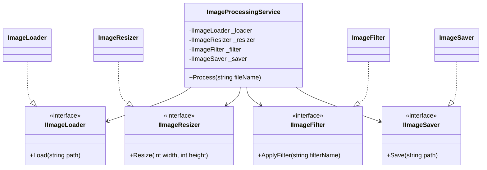

## 1. Поясніть принцип єдиної відповідальності (SRP). Чому він важливий для проектування?

Single Responsibility Principle (SRP) — це перший принцип з набору SOLID. Він стверджує, що клас повинен мати лише одну причину для зміни.

- Легкість підтримки: Якщо логіка розділена, зміна в алгоритмі фільтрації не зламає код, який відповідає за збереження файлів.
- Тестування: Значно легше написати тест для маленького методу Resize, ніж для гігантського методу, що робить усе підряд.
- Повторне використання: Ви можете використати клас ImageLoader в іншому проєкті, не тягнучи за собою логіку обробки чи логування.

## 2. Що таке “God Object” і як він порушує SRP?

God Object (Об'єкт-Бог) — це антипатерн проектування, коли один клас бере на себе занадто багато функцій (знає все і вміє все).

Як він порушує SRP: Він стає «центром всесвіту» програми. Будь-яка зміна в бізнес-логіці, роботі з базою даних або форматі виводу вимагає редагування цього одного класу. Це призводить до появи крихкого коду: ви змінюєте кому в одному місці, а «падає» вся система.

## 3. Як декомпозиція допомагає дотримуватися SRP? Наведіть приклад.

Декомпозиція — це процес розбиття великої задачі на менші підзадачі. В контексті SRP це перетворення одного багатофункціонального класу на групу взаємодіючих об'єктів.

Приклад: Наприклад клас ReportManager. Замість того, щоб він сам:

- Витягував дані з БД.
- Форматував їх у PDF.
- Відправляв на Email.

Ми проводимо декомпозицію на: ReportDataRepository, PdfFormatter та EmailService. Тепер кожен клас має свою зону відповідальності.

## 4. Як діаграми класів (UML) допомагають візуалізувати та аналізувати розподіл відповідальностей?

UML Class Diagram — це «рентгенівський знімок» вашої архітектури.

Як вони допомагають:

- Візуалізація зв'язків: Ви одразу бачите, чи не занадто багато стрілок (залежностей) входить в один клас. Якщо від одного класу тягнеться 10 стрілок до інших — це явна ознака порушення SRP.
- Аналіз інтерфейсів: На діаграмі легко помітити методи, які не пасують до назви класу.
- Планування: Ви можете спроектувати систему на папері або в редакторі ще до того, як напишете перший рядок коду, що економить час на майбутньому рефакторингу.

## [Поганий приклад коду](./Legacy/BadImageProcessor.cs)

## Діаграма Mermaid:

