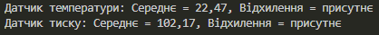

---

## Висновки
У результаті виконання лабораторної роботи:  
- закріплено знання з теми **абстракції та інтерфейси** у C#;  
- реалізовано **ієрархію сенсорів** із використанням інтерфейсу `ISensor`;  
- застосовано **композицію** для об’єднання сенсорів у систему;  
- реалізовано прості **обчислення середніх значень** та **виявлення відхилень**;  
- продемонстровано, що абстракції спрощують розширення системи новими типами сенсорів.  

Таким чином, було досягнуто поставленої мети: розроблено гнучку, масштабовану та повторно використовувану систему з використанням об’єктно-орієнтованих принципів.

---

## Ілюстрація
Нижче наведено приклад роботи програми:  

